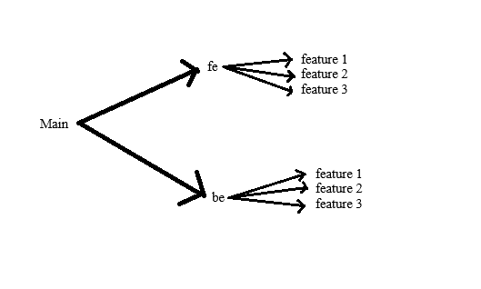

# College Street
## CS673 FA2023 TEAM 6 Project

### ABOUT :
A student marketplace for all your needs. Students now struggle to adjust to a new city and have problems finding textbooks, furnishings, notes, etc. (Project name) is the solution to all the student problems. Students may offer their used furniture, textbooks, and other items, making it easier for new students to establish in a new location. The potential users would be the students in Boston, we plan to restrict the application to student email addresses. The primary technology stack that we will be implementing will be ReactJS for front-end development and Python [RestAPI] and Postgresql database for back-end development. 

### Local Set up
 - [Front-End](https://github.com/BUMETCS673/CS673F23TEAM6/blob/main/code/web-app/Readme.md)
 - [Back-End](https://github.com/BUMETCS673/CS673F23TEAM6/blob/main/code/server/README.md)

### Tech Stack :
Front-End : 
 - ReactJS with Javascript
 - TailwindCSS ( for styling)
Back-End : 
 - Python 3.x
 - Django with Django-rest Framework : For Model and everything
 - [Sanity](https://www.sanity.io/) : CDN service -  Decided to use Cloudinary
 - [Supabase](https://supabase.com/) : Postgres database and hosting it

### Completed Features :
- User Authen: Login, Logout, Signup
- Homepage : About, Contact Us
- Main Page : Marketplace Post listing
- Create/Delete/Update Posts ( that is items to sell/buy)
- Text Search/ Filters : Location/Price/Tags
- Direct Message : Contact other users
- User Profile : View/Edit

### Local Set up
 - [Front-End](https://github.com/BUMETCS673/CS673F23TEAM6/blob/main/code/web-app/Readme.md)
 - [Back-End](https://github.com/BUMETCS673/CS673F23TEAM6/blob/main/code/server/README.md)

### Team Members:
-Theerarun Tubnonghee (Steve) | Team Lead - Frontend Implementation
-Aishwarya Raja | Configuration Lead - Backend Implementation
-Nidhi Desai | QA Lead - Testing Implementation
-Subhajit Das (Jeet) | Backend Lead - Backend Implementation
-Chenyang Lyu (Nick) | Frontend Lead - Frontend Implementation
-Yin Xiancheng (Xanthus) | DevOps Lead - Backend Implementation
-Vedant Gupta | Design/Implementation Lead - Frontend Implementation

### CONTRIBUTION STANDARD:
Initially all the codes and changes are pushed to the main branch. Consequently, it delivered code crashes and faced synchronizations. 
In order to avoid this synchronization, we created two branches which are fe (frontend) and be (backend). All the changes made in the frontend part are pushed to the branch fe. All the changes and performance happening in the backend are updated and pushed to the branch be. This makes a very clear path for everyone to understand where the changes and updates are made. Teammates are not given access to push the changes or update directly to the main branch.  The modified codes will be reviewed before PR (pull request). 
Finally, the two branches fe and be will be reviewed and pushed to the main branch by the team leads. Here is a simple diagrammatic view of how this algorithm works.

